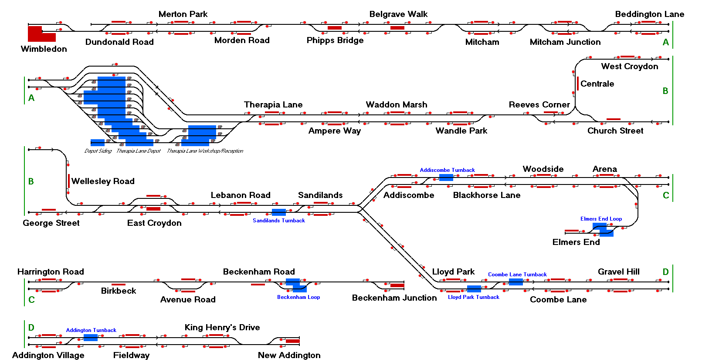

# Croydon Tramlink
The entire Croydon Tramlink network in south London.

## Current Status

| Stage         | Status        |
| ------------- |:-------------:|
| Track Plan     | :heavy_check_mark: |
| Signalling      | :heavy_check_mark:      |
| Naming | :heavy_check_mark:      |
| Speed Limits | :heavy_check_mark: |
| Distances | :heavy_check_mark: |
| Timetable | :heavy_check_mark: |
| Documentation | :heavy_check_mark: |

## Data Sources

- [CartoMetro](https://cartometro.com/cartes/metro-tram-london/?r=cmf)
- [OpenRailwayMap](https://www.openrailwaymap.org/)
- [MapMeurisse](https://map.meurisse.org/)
- [TfL](https://tfl.gov.uk/tram/timetable/tram/)
